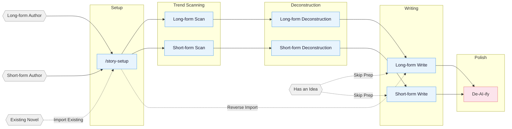

<!-- Last synced with README.md: 2026-07-11 -->

**English** | [中文](README.md)

# oh-story-claudecode

A web novel writing skill pack with built-in adapters for Claude Code, OpenCode, ZCode, OpenClaw, Codex CLI, Reasonix, and workbuddy. Web AI / agent environments that can read project files can use the generic skills path. Covers the full pipeline for long-form and short-form Chinese web novels: trend scanning, deconstruction, writing, AI tone removal, and cover generation.

## Core Approach

> **Tropes = deterministic emotional payoff**

Professional authors follow a three-step method:

1. **Scan** — analyze trending charts, identify genres, characters, and entry points.
2. **Deconstruct** — break down pacing and plot materials, build a personal module library.
3. **Commercialize** — learn and apply hooks, payoff density, expectation management.

Built around four pillars: reverse-engineering hits · plot modularization · layered state management · human-AI collaboration.

> Starting in v0.7.0: two more runtimes — native ZCode 3.3.4 (install the repo as a marketplace/plugin, `story-setup target_cli=zcode`) and Reasonix Phase 1 (skills + native plugin manifest); hook cores unified onto a shared node core with a six-runtime parity lock; long-form unifies the five old names (plot-strand / loop-card / …) into "剧情单元" (plot unit) and feeds decomposition output into volume/chapter outlines; the anti-AI-tone gate is now mechanized — the post-write prose net auto-scans deterministic toxic phrasings, and a "toxic-phrase debt gate" blocks the next chapter until the previous one is cleared (stateless, node-missing fails open, opt out explicitly with `<!-- 去味:跳过 -->`). Deployed projects should rerun `/story-setup` and start a new session.
>
> Starting in v0.6.22: long-form prose gains per-genre "prose prompt cards" — 32 番茄-genre voice cards recalled into the writer at draft time (card text never leaks into prose), plus outline-boundary and per-chapter formula gates against padding; short-form adds a submission layer `submission-craft` (Zhihu Yanxuan / mini-program / Fanqie platform tones, lead-in polish, paywall breakpoint design); suite-wide skill docs deduplicated by ~33KB; story-setup adds generic Web AI deployment. Deployed projects should rerun `/story-setup` and start a new session.
>
> Starting in v0.6.21: short-form writing reference cleanup — `story-short-write` drops stale long-form inherited references and now uses `short-format` / `short-craft` / `short-deslop` plus four genre packs (wife-chasing crematorium, revenge face-slap, CEO/wealthy family, domestic/palace intrigue) for short-story format, direct emotion, pacing density, and AI-tone cleanup; existing deployed projects should rerun `/story-setup` and start a new session to pick up the updated narrative-writer short-story exception.
>
> For earlier versions, see [CHANGELOG.md](CHANGELOG.md).

## Pipeline Overview



## Installation

**Option 1** Tell Claude Code / OpenCode / ZCode / OpenClaw / Codex, or another Web AI / agent platform that can import a GitHub repo or skill:

```
Install this skill https://github.com/worldwonderer/oh-story-claudecode
```

**Option 2** Command line:

```bash
npx skills add worldwonderer/oh-story-claudecode -y -g
```

`-g` installs globally (available in every directory); drop `-g` to install only into the current directory. Re-run the same command to update.

> After updating, if a project has already run `/story-setup`, re-run `/story-setup` from the project root to sync hooks / agents / references. Per-version changes are in [CHANGELOG.md](CHANGELOG.md) and [Releases](https://github.com/worldwonderer/oh-story-claudecode/releases).
>

> **Codex users:** Use it in-place: Codex scans `$REPO_ROOT/.agents/skills` (a symlink to `skills/`) and discovers all 13 skills; invoke via `$story`, `$story-setup`, or `/skills`. On Windows, enable git `core.symlinks=true` or the symlink breaks — then use the `$story-setup` deployment below.
> After `$story-setup` deploys into a writing project, it creates `.codex/agents/*.toml`, `.codex/hooks.json`, `.codex/hooks/{story_codex_hook.py,run-story-hook.sh,run-story-hook.cmd}`, and `.codex/skills/story-setup/references/agent-references/`. Trust the project `.codex/` layer, review/trust hooks in `/hooks`, and open a fresh Codex session so custom agents load.
>
> **ZCode users:** Add this repository as a marketplace in Plugin Management and install `oh-story`; then invoke the 13 Skills/Commands through `$story`, `$story-setup`, or the `/` panel. With `target_cli=zcode`, `$story-setup` deploys `.zcode/skills/`, `.zcode/commands/`, and `.zcode/hooks/story_zcode_hook.js`, then safely merges `.zcode/config.json` and the root `AGENTS.md`. Hooks require `node` on PATH. ZCode 3.3.4 does not execute project/plugin custom agents and has no `PreCompact` or `SessionEnd`; affected workflows report a solo/direct fallback, while `SessionStart` restores context after compaction.
>
> **OpenCode users:** After global install, opencode auto-discovers skills from `~/.claude/skills/`; trigger story-setup with natural language on first use (e.g., "use story-setup to deploy the web novel environment"), then **exit and re-enter with `opencode -c`** for slash commands to work. Some hook behaviors differ from Claude Code (session-start / session-end / compact, etc.) — see the OpenCode section in [CONTRIBUTING.md](CONTRIBUTING.md).
>
> **OpenClaw users:** Current support is skills-only. OpenClaw can discover the 13 story skills from workspace `skills/`, `.agents/skills`, `~/.agents/skills`, `~/.openclaw/skills`, or configured extra skill roots. `SKILL.md` files use OpenClaw-compatible single-line `name` / `description` plus single-line JSON `metadata.openclaw`. When `story-setup` targets OpenClaw, it copies the skills into project `skills/` and writes an OpenClaw `AGENTS.md`; agents/hooks are intentionally deferred, so outline-before-prose guards are soft skill checks rather than runtime enforcement. If new skills do not appear immediately, open a fresh OpenClaw session or wait for the skills watcher to refresh.
>
> **Reasonix users:** Current support is Skills + a native plugin manifest (Phase 1). Reasonix natively scans `.agents/skills` (a symlink to `skills/`) and discovers all 13 skills — verify with `reasonix doctor capabilities`; you can also `reasonix plugin install` via the root `reasonix-plugin.json`. Project-level `story-setup` deployment and hooks are later phases. If Windows symlinks are disabled, use the native plugin instead.
>
> **Generic Web AI / agent users:** If your platform can read a GitHub repo or project files, have the agent read `skills/*/SKILL.md` plus the relevant `references/`. For local project copies, run `story-setup` with `target_cli=generic`; it only writes a generic `AGENTS.md` and `skills/`. Without this project's hooks/custom agents, checks run as skill-level soft constraints or solo/direct fallbacks.

> **Multi-agent collaboration needs setup + a fresh session**: the 7 specialist agents (story-architect, narrative-writer, consistency-checker, etc.) are written into your project's `.claude/agents/` by `/story-setup`, or into `.codex/agents/*.toml` by `$story-setup`. Claude Code and Codex register custom agents most reliably at session start; ZCode 3.3.4, OpenClaw Phase 1, Reasonix Phase 1, and the generic path default to skills + solo fallback. To check Claude/Codex agents: run `/story-review` in the new session — `Effective Mode: full/lean` means agents registered, `Fallback: ... -> solo` means they are unavailable.

## Skills

| Skill | Trigger | Description |
|:------|:--------|:------------|
| `story-setup` | `/story-setup` / `$story-setup` | Environment setup — Claude/OpenCode/Codex/ZCode/OpenClaw plus generic (safe merge) |
| `story` | `/story` / `$story` | Toolbox router — routes fuzzy intents to the matching skill |
| `story-long-write` | `/story-long-write` | Long-form writing — outline building, character design, prose output |
| `story-long-analyze` | `/story-long-analyze` | Long-form deconstruction — Golden First 3 Chapters, payoff design, pacing analysis |
| `story-long-scan` | `/story-long-scan` | Long-form trend scan — Qidian/Fanqie/Jinjiang market trends |
| `story-short-write` | `/story-short-write` | Short-form writing — emotion design, twist crafting, polish & delivery |
| `story-short-analyze` | `/story-short-analyze` | Short-form deconstruction — story core, structure, emotional arc, reversal design, writing techniques, resonance analysis |
| `story-short-scan` | `/story-short-scan` | Short-form trend scan — Zhihu Yanayan/Fanqie short-form trending data |
| `story-deslop` | `/story-deslop` | De-AI-ify — detect and remove AI writing traces |
| `story-import` | `/story-import` | Reverse import — parse existing novels into standard project structure |
| `story-review` | `/story-review` | Multi-perspective review — 4-agent adversarial review + Fanqie/Qidian/Zhihu scoring rubrics |
| `story-cover` | `/story-cover` | Cover generation — title & genre analysis + GPT-Image-2 image generation |
| `browser-cdp` | `/browser-cdp` | Browser control — CDP protocol for scraping with reusable login sessions |

> `story-deslop` uses local prose linting: blocking applies only to deterministic style/punctuation issues, while other findings require read-through judgment; external detectors such as Zhuque are self-check references, not replacements for human review.

Natural language also triggers: `帮我开书` ("help me start writing") → `story-long-write`, `这篇太AI了` ("this is too AI-ish") → `story-deslop`, `把我的书导进来` ("import my book") → `story-import`, `沈栀现在什么状态` ("what's Shen Zhi's current status") → `story-explorer`.

<details>
<summary>Cover generation example</summary>


</details>

<details>
<summary>Deconstruction demo — Coiling Dragon</summary>

Full output from `/story-long-analyze` deep mode on the first 23 chapters of *Coiling Dragon*:

```
demo/拆文库-盘龙/
├── 概要.md              # Novel overview + chapter index
├── 拆文报告.md           # 5-dimension scoring + pacing analysis + takeaways
├── 文风.md              # Benchmark voice: sentence rhythm, punctuation, dialogue subtext, emotion pacing
├── 章节/
│   ├── 第1章_深度拆解.md  # Golden三章 deep analysis
│   └── 第1-23章_摘要.md   # Per-chapter summary + plot points + character mentions
├── 角色/
│   ├── 林雷.md           # Protagonist full profile
│   ├── 霍格.md           # Core supporting
│   ├── 希尔曼.md         # Core supporting
│   ├── 德林柯沃特.md      # Core supporting
│   ├── 沃顿.md           # Functional character
│   └── 角色关系.md        # Relationship network
├── 剧情/
│   ├── 故事线.md          # Framework + 4 plotlines + 2 storylines
│   ├── 节奏.md            # Pacing + key-info progression + emotional trigger eruption rhythm
│   └── 情绪模块.md        # Reader needs + emotional engine + reusable writing modules
└── 设定/
    ├── 世界观/
    │   ├── 背景设定.md    # Core rules + special settings
    │   ├── 力量体系.md    # Battle qi + magic + ranks
    │   ├── 地理.md        # Andaluxia + Yulan Continent
    │   └── 金手指.md      # Panlong Ring + Delin Cowort
    └── 势力/
        └── 巴鲁克家族.md  # Baluk family (dragon-blood lineage)
```

Long-form deconstruction also produces `文风.md`, plus `剧情/节奏.md` (pacing, key-info progression, emotional trigger eruption rhythm) and `剧情/情绪模块.md` (reader needs, emotional engine, reusable writing modules); daily writing consumes these through `对标/{书名}/剧情/` to keep voice, pacing, and emotion modules close to the benchmark.

</details>

<details>
<summary>Deconstruction demo — Once I Hid My Love (曾将爱意私藏, short-form)</summary>

`/story-short-analyze` deconstructing the short story 《曾将爱意私藏》 (~8,500 chars, win-back / "faked-death" genre):

```
demo/拆文库-曾将爱意私藏/
├── 原文/原文.txt        # Source backup
├── 拆文报告.md          # Story core + 5-dim scores + 6-facet payoff + cognitive reversal + 9-layer resonance
├── 情节节点.md          # 54 plot points (source quotes + emotion markers −9~+9)
├── 写作手法.md          # POV / dialogue / info-gap / object-hook — 11 techniques
└── _meta.json           # structure_counts (Phase 7 gate basis)
```

Short-form deconstruction outputs `拆文报告 / 情节节点 / 写作手法`; downstream `/story-short-write` writes a new same-genre story from them.

</details>

<details>
<summary>Import demo — 让你管账号，你高燃混剪炸全网 (long-form continuation project)</summary>

`/story-import` reverse-builds the author's already-published first 20 chapters (~37k chars) into a continuation-ready writing project, handed off to `/story-long-write` for daily writing from chapter 21:

```
demo/让你管账号，你高燃混剪炸全网/
├── 正文/        Chapters 001–020 (published source text)
├── 大纲/        大纲.md · 卷纲_第1卷.md · 细纲_第001–020章.md (one file per chapter)
├── 设定/        角色/ (6 character files) · 世界观/{background · cheat-system}
│                关系.md · 题材定位.md · 文风.md
├── 追踪/        伏笔.md (foreshadowing) · 时间线.md (timeline) · 角色状态.md (state) · 上下文.md
└── 参考资料/    作品信息.md
```

Per-chapter extraction (events / characters / settings / foreshadowing / timeline) is reverse-engineered into a continuation bible, so the author seamlessly continues from chapter 21.

</details>

## Agent System

Writing skills internally coordinate 7 specialized agents:

| Agent | Model | Role |
|:------|:------|:-----|
| **story-architect** | Opus | Story architecture — genre positioning, outline structure, hook/twist design, emotion arcs |
| **character-designer** | Sonnet | Character design — profiles, voice, motivation chains, dialogue writing |
| **narrative-writer** | Sonnet | Narrative writer — prose writing, de-AI-ify, format compliance |
| **consistency-checker** | Haiku | Consistency check — fact conflict scanning, foreshadowing tracking, S1-S4 grading reports |
| **story-researcher** | Sonnet | Research — CDP search + full-text extraction, multi-source cross-verification, structured reference files |
| **story-explorer** | Haiku | Story query — read-only character/foreshadowing/setting/progress lookup, quick context loading |
| **chapter-extractor** | Haiku | Chapter extraction — summaries, plot points, character mentions, parallel deconstruction unit |

Agents load writing theory from `references/` on demand (character design, dialogue techniques, twist toolbox, etc. — 100+ methodology files), without reserving context window space.

## Automation Hooks

7 hooks deployed automatically by `/story-setup`:

| Hook | Trigger | Function |
|:-----|:---------|:---------|
| session-start.sh | Session start | Display branch, progress snapshot, deconstruction status |
| session-end.sh | Session end | Log session to `追踪/session-log.txt` |
| detect-story-gaps.sh | Session start | Detect setting gaps, missing outlines, foreshadowing breaks |
| pre-compact.sh | Before context compaction | Save progress snapshot path and line-count summary |
| post-compact.sh | After context compaction | Prompt to read progress snapshot for context recovery |
| validate-story-commit.sh | git commit | Check hardcoded attributes, setting required fields (warning only, non-blocking) |
| guard-outline-before-prose.sh | Before writing prose (Write/Edit) | Blocks first creation of a chapter/story body when its 细纲/小节大纲 is missing (blocking) — enforces outline-first |

## Project File Structure

A long-form novel can easily reach hundreds of thousands of words across hundreds of chapters. Setting conflicts, broken foreshadowing, timeline inconsistencies — relying on memory alone is a recipe for disaster.

The file system separates settings, outlines, prose, and tracking into independent dimensions. The conversation handles creation; the file system handles memory.

**Long-form:**

```
{Book Title}/
├── Settings/
│   ├── World/              # Background, power systems, etc. — one file per topic
│   ├── Characters/         # One file per character (Shen_Zhi.md, Lu_Yanzhi.md)
│   ├── Factions/           # One file per faction/organization (Tianji_Pavilion.md)
│   ├── Relationships.md    # Character relationship map
│   └── Genre_Positioning.md # Core trope + benchmark analysis
├── Outline/
│   ├── Outline.md          # Full-book volume-level structure
│   ├── Volume_1.md         # One per volume: payoff pacing + emotion arc + character arc + foreshadowing + twists
│   ├── Chapter_001.md      # One per chapter: summary + multi-line plot + relationships/order + hooks
│   └── ...
├── Prose/
│   ├── Chapter_001_Title.md
│   └── ...
├── Benchmark/                # Benchmark reference (structured subdirs synced from deconstruction)
│   └── {Benchmark Book}/
│       ├── Source/              # Benchmark book original chapters
│       ├── Characters/         # Structured character profiles (synced from analyze)
│       ├── Plotlines/          # Structured plot lines/pacing/emotion modules (synced from analyze)
│       ├── Settings/           # Structured world settings (synced from analyze)
│       ├── 文风.md              # Benchmark voice used before daily writing
│       └── Report.md            # Analyze skill output
├── Tracking/                # Continuity management (layered tracking)
│   ├── Context.md           # Writing context (for compact recovery)
│   ├── Foreshadowing.md     # Foreshadowing planted/resolved status table (cross-volume)
│   ├── Timeline.md          # In-story timeline (full-book)
│   └── Character_Status.md  # Character current state snapshots (per-chapter)
├── References/              # story-researcher output
│   └── {topic}.md           # Split by research topic
```

**Short-form file structure:**

```
短篇/{Title}/
├── 正文.md                  # Final draft
├── 小节大纲.md              # 8-section structure + emotion curve
└── 拆文库/                  # If a reference novel exists (analyze output)
    └── {Book}/
        ├── 拆文报告.md
        ├── 情节节点.md
        └── 写作手法.md
```

**Deconstruction Library:** Deconstruction skills save structured outputs (characters, plotlines, settings, chapters) under `拆文库/{Book Title}/` at project root; long-form plot output includes `节奏.md` and `情绪模块.md`. Writing skills consume these assets through `对标/{书名}/剧情/` and related benchmark subdirectories, or automatically fall back to reading from the deconstruction library.

## Knowledge Base

Each skill includes a `references/` knowledge base loaded on demand to keep context lean.

<details>
<summary>Expand the per-skill knowledge-base topic list</summary>

| Topic | Contents | Skill |
|:------|:---------|:------|
| Outline Layout | Five-step outline method · Story structure levels · Node design · Progression design | long-write |
| Opening Design | Opening patterns · First 500 words · Golden First 3 Chapters | long-write / short-write |
| Character Design | Character profiles · Character extraction · Relationship mapping · Motivation chains · Ensemble casts | long-write / short-write / short-analyze |
| Hook Techniques | 13 chapter-end hooks · 7 chapter-start hooks · Paragraph-level hooks · Suspense orchestration | long-write / short-write / short-analyze |
| Emotion Design | 6 arc templates · Expectation management · Genre track strategies | long-write / short-write |
| Genre Frameworks | Long-form 8-node · Short-form compressed 3-act · 8 genre opening templates | long-write / short-write / short-analyze |
| Dialogue Techniques | Rhythm · Subtext · Information control · Dialogue pattern database | long-write / short-write |
| Twist Toolbox | Types · Timing · Misdirection base paths | long-write / short-write |
| Style Modules | Dialogue · Combat · Mind games · Cinematic writing · Face-slapping · Plain description | long-write |
| Advanced Techniques | 4-step micro-outline · Climax reverse-engineering · Dual-thread structure · AB interweaving | long-write |
| De-AI-ify | Prevention · 3-pass de-AI method · Rewrite examples · Banned word list | deslop / long-write / short-write |
| Quality Checks | General · Long-form specific · Short-form specific · Toxic trope detection | long-write / short-write / short-analyze |
| Writing Formulas | 21 genre formulas · Three-flip-four-shock (escalating reversal) · Romance four-stage | short-write / short-analyze |
| Female-oriented Writing | Female reader preferences · Emotional description · Romance patterns · Benchmark analysis | short-write |
| Deconstruction Methods | Golden First 3 Chapters · Emotion curves · Structure breakdown · Zhihu style analysis | long-analyze / short-analyze |
| Short-form Methodology | Story core · Plot nodes · Explosive point analysis · Writing techniques · Rhythm analysis · Resonance analysis · Character classification · Platform fit | short-analyze |
| Deconstruction Examples | Full case breakdowns · Template output | short-analyze |
| Reader Profiles | 9-dimension profiles · Target reader analysis | long-scan |
| Market Data | Genre trends · Platform characteristics · Collection formats · Submission guides | long-scan / short-scan |
| Cover Styles | 10 genre visual styles · Color composition · Prompt templates | story-cover |
| Adversarial Review | Multi-perspective review · Scoring rubrics · Toxic trope detection | story-review |

</details>

## Supported Platforms

**Long-form** Qidian (起点中文网) · Fanqie Novels (番茄小说) · Jinjiang (晋江文学城) · Qimao (七猫小说) · Ciweimao (刺猬猫)

**Short-form** Zhihu Yanayan (知乎盐言故事) · Fanqie Short-form (番茄短篇) · Qimao Short-form (七猫短篇)

Real output samples are in [demo/](demo/): short-form deconstruction 《曾将爱意私藏》 · long-form deconstruction 《盘龙》 · long-form continuation project 《让你管账号，你高燃混剪炸全网》 · cover sample 《剑道独尊》.

I built this skill pack to help me through a job-hunting transition :joy:, and I hope it can help others too.

## Star History

<a href="https://www.star-history.com/?repos=worldwonderer%2Foh-story-claudecode&type=date&legend=top-left">
 <picture>
   <source media="(prefers-color-scheme: dark)" srcset="https://api.star-history.com/chart?repos=worldwonderer/oh-story-claudecode&type=date&theme=dark&legend=top-left" />
   <source media="(prefers-color-scheme: light)" srcset="https://api.star-history.com/chart?repos=worldwonderer/oh-story-claudecode&type=date&legend=top-left" />
   
 </picture>
</a>

## Contributing

Contributions are welcome — new skills, knowledge base additions, market data updates. See [CONTRIBUTING.md](CONTRIBUTING.md) (Chinese only).

## Community

- **Telegram**: <https://t.me/ohstoryclaudecode> — chat, troubleshooting, and feature discussion.
- **GitHub Discussions**: [ask questions, get help, share workflows](https://github.com/worldwonderer/oh-story-claudecode/discussions).

## Acknowledgments

- [LINUX DO - The New Ideal Community](https://linux.do) — Community support
- [FanqieRankTracker](https://github.com/wen1701/FanqieRankTracker) — Fanqie Novels font obfuscation decoding reference
- [Zhuque AIGC Detector CLI](https://github.com/Sophomoresty/zhuque) — External retest reference used during anti-AI-writing experiments
